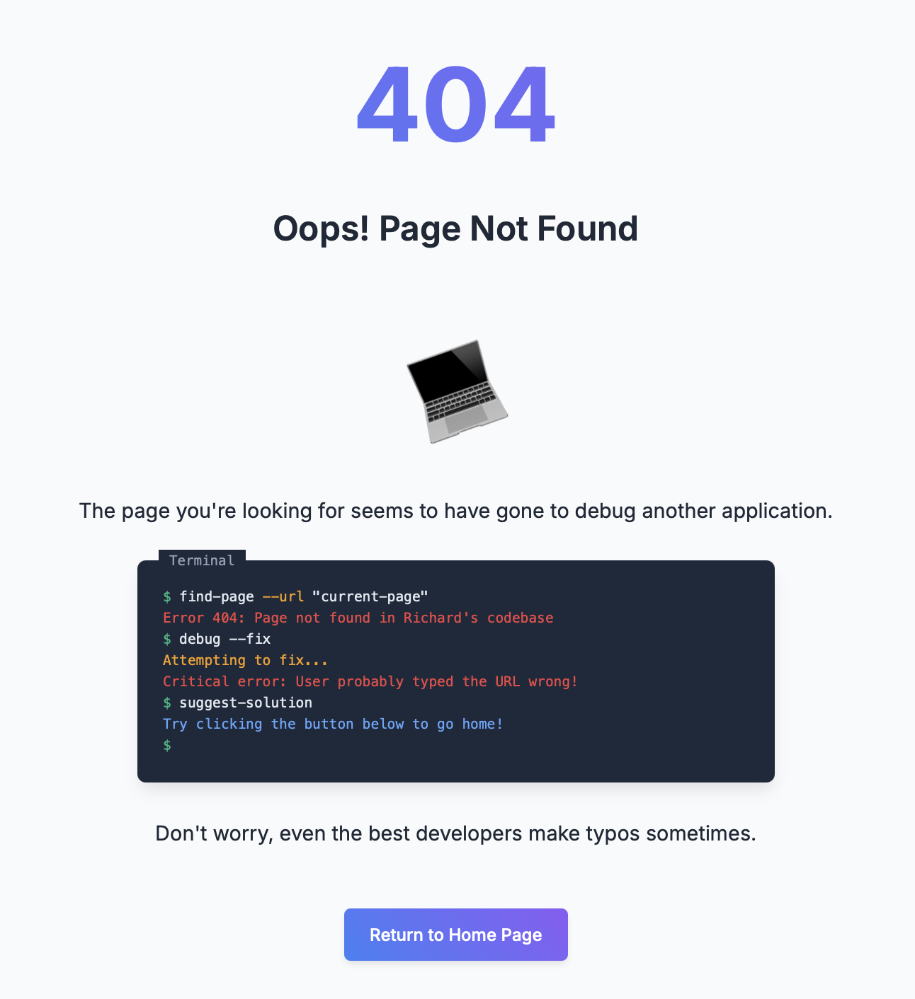

# Richard's 404 Page

A clever, developer-themed 404 page with random programming jokes for use across [richardp23.com](https://richardp23.com) and all of my personal projects.



## Features

- Terminal-themed error message
- Random programming jokes generator with 12+ developer jokes
- Responsive design that works on all devices
- Animated elements for visual interest
- Self-contained single HTML file for the final output

## Project Structure

```
├── dist/
│   ├── 404.html              # Final standalone HTML file (main output)
│   ├── scripts/              # Compiled TypeScript utilities
│   │   └── create-standalone.js
│   └── source/               # Parcel-built assets (intermediate files)
│       ├── index.html
│       ├── index.[hash].js
│       └── index.[hash].css
├── src/
│   ├── index.html            # Source HTML template
│   ├── index.ts              # Main TypeScript code
│   ├── jokes.ts              # Jokes data
│   ├── styles.css            # Styles
│   └── scripts/              # Build scripts
│       └── create-standalone.ts
├── package.json
├── tsconfig.json
└── README.md
```

## Technologies Used

- TypeScript
- HTML5/CSS3
- Parcel (for bundling)
- Prettier (for code formatting)

## Development

### Prerequisites

- Node.js (>= 14.x)
- npm or yarn

### Setup

```bash
# Clone the repository
git clone https://github.com/YOUR-USERNAME/richard-404.git
cd richard-404

# Install dependencies
npm install

# Start development server
npm start
```

### Building for Production

```bash
npm run build
```

This will create a standalone `404.html` file in the `dist` directory.

## Customization

### Changing the Redirect URL

By default, the 404 page redirects to the root path ("/") when the user clicks the "Return to Home Page" button. To change this to your own project or website:

1. Open the generated `404.html` file
2. Look for the element with `id="change-redirect-here"` (around line 201)
3. Change the `href` attribute to your desired URL

For example, to redirect to your GitHub profile:

```html
<a href="https://github.com/your-username" class="action-btn" id="change-redirect-here">Return to Home Page</a>
```

Or for a relative URL to another page on the same site:

```html
<a href="/projects" class="action-btn" id="change-redirect-here">Return to Home Page</a>
```

You can also modify the button text by changing the content between the opening and closing tags.

### Adding Custom Jokes

To add your own jokes to the rotation:

1. Edit `src/jokes.ts`
2. Add new jokes following the existing format
3. Rebuild the project with `npm run build`

## Deployment

### For GitHub Pages

1. Copy the generated `404.html` file to the root of your GitHub Pages repository
2. GitHub will automatically use this file when a user navigates to a non-existent page

### For Other Web Servers

1. Upload the `404.html` file to your web server
2. Configure your server to use this file when returning 404 errors

## Credits

This 404 page was created with the help of claude-3.7-sonnet-thinking (Cursor v0.46).

## License

MIT License - see [LICENSE.md](LICENSE.md) for details.